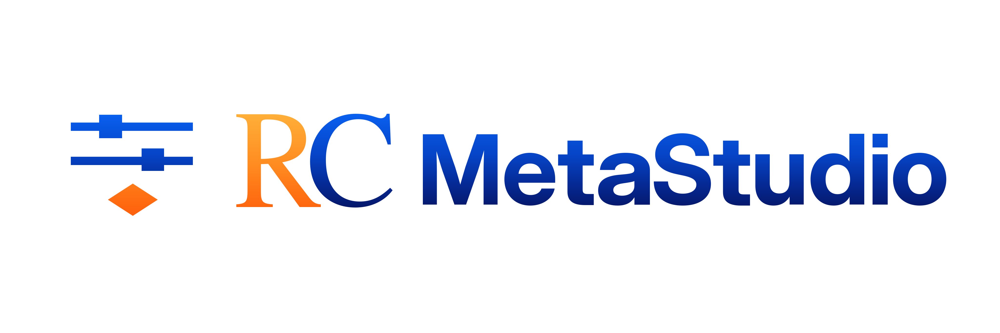

# RC MetaStudio

RC MetaStudio is an open-source desktop application for performing and reviewing meta-analyses without writing code.

It supports standard, cumulative, leave-one-out, subgroup, meta-regression, and diagnostic analyses. You can inspect results, create forest and bubble plots, export plots as PDF, PNG, SVG, or TIFF, and save your work in an `.rcms` project.

## Small-study effects analysis

Choose **Publication Bias** after at least two included studies to open the guided small-study effects analysis. “Publication Bias” is the navigation label; the analysis reports associations between study size or precision and observed effects and does not provide a bias-present or bias-absent verdict. RCMetaR computes method-specific eligibility from the included study set and shows the exact reason when a procedure or required input is unavailable. Ordinary and contour-enhanced funnels are presentation artifacts that can be edited and regenerated from the saved run. Diagnostic odds ratios use the separate Deeks effective-sample-size funnel.

The workflow reports the package-native methods supported by `meta` 8.5-0 and the distinct mixed-effects Egger model from `metafor` 5.0-1. Depending on the effect measure and available raw inputs, it can show classical Egger, Harbord, Rücker AS+RE, Peters, Pustejovsky–Rodgers, Begg–Mazumdar, Deeks, trim-and-fill, and exploratory infinite-precision estimates. Each result includes its package/version and call; unavailable procedures retain their precise eligibility reason. Read the [small-study effects glossary](CONTEXT.md) for interpretation boundaries and the [release guide](docs/release.md) for runtime verification requirements.

## Download and install

Download the latest release from [GitHub Releases](https://github.com/AliSalman-et-al/rc-metastudio/releases):

- Windows x64: `RCMetaStudio-windows-x64.zip`
- Intel Mac: `RCMetaStudio-macos-x64.dmg`
- Apple silicon Mac: `RCMetaStudio-macos-arm64.dmg`

On Windows, extract the archive and run `RCMetaStudio.exe`.

On macOS, open the disk image, drag RC MetaStudio to Applications, and launch it from Applications. The macOS application is Developer ID signed, notarized, and stapled. The Windows package is currently unsigned.

## Feedback

Report bugs and request improvements through [GitHub Issues](https://github.com/AliSalman-et-al/rc-metastudio/issues). Describe what happened, what you expected, and how to reproduce it. Do not attach private project data.

Public code contributions are not currently accepted. See [CONTRIBUTING.md](CONTRIBUTING.md) for details.

## Development

See [Maintaining RC MetaStudio](docs/maintaining.md) for setup, verification, and repository conventions. The [project format reference](docs/project-format.md) documents `.rcms` files, and the [release guide](docs/release.md) covers the build and promotion workflow.

## License and provenance

RC MetaStudio is developed by Research Consultancy (RC) and maintained by Ali Salman and RC MetaStudio contributors. It is derived from the Original OpenMeta[Analyst] Project.

The project is distributed under the GNU General Public License, version 3 or later, where permitted by the original GPL-2.0-or-later grant covering derived portions. See [LICENSE](LICENSE) and [NOTICE.md](NOTICE.md) for the full terms, provenance, warranty, and affiliation disclaimer.
