# Clean-slate desktop delivery architecture

## Scope and decision

This report proposes a complete rebuild of RC MetaStudio's build, continuous
integration, testing, packaging, signing, release, provenance, and rollback
system for Windows x64 and macOS Intel. It is a target architecture, not a
patch plan for the current YAML.

The central decision is:

> Build each native target once from an immutable commit, verify and sign that
> exact output, then promote the same bytes through candidate and stable
> channels. Use one cross-platform delivery contract and policy engine, with
> thin adapters only for operations that are inherently platform-specific.

This is stronger than making two workflows look similar. It prevents semantic
drift between platforms and makes a release an auditable set of immutable
objects rather than the result of rerunning a tag workflow.

## Executive recommendation

Rebuild delivery around a versioned release-set manifest and five explicit
stages: verify source, assemble unsigned native packages, sign/notarize, verify
the final bytes, and promote. Run the same contract on Windows x64 and macOS
Intel; keep only assembly, signing, and native verification behind OS adapters.
Candidates should be built from a full protected-main SHA, and stable releases
should promote those exact candidate digests without rebuilding. Add input
freezing first, native trust second, then packaged-tree SBOMs and GitHub
provenance attestations. Retire the current tag-triggered build-and-clobber path
only after two shadow runs and one successful release candidate prove the new
path end to end.

## Current-state diagnosis

The repository has several sound foundations:

- Python is constrained to 3.11 and dependencies are recorded in `uv.lock`.
- external GitHub Actions are pinned to full commit SHAs;
- source verification and packaging are separate workflows;
- Windows x64 and macOS Intel now call one reusable packaging workflow;
- both supported package scripts call a shared release verifier;
- R evidence fails closed, packaged launch checks use an explicit automation
  mode, and adaptive-layout evidence has a structured validator;
- final artifacts are built natively rather than cross-compiled.

Those choices should be retained. PyInstaller's bootloader and collected
binaries are platform-specific, so a distributable must be built on its target
OS; PyInstaller also validates macOS target architecture during collection
([PyInstaller operating mode](https://pyinstaller.org/en/stable/operating-mode.html),
[PyInstaller macOS notes](https://pyinstaller.org/en/stable/feature-notes.html#macos-specific-options)).

The important remaining weaknesses are architectural:

1. Verification, dependency acquisition, app construction, native evidence,
   archive creation, and publication still occur inside one package command.
   There is no explicit state machine or machine-readable handoff between
   stages.
2. A pushed `v*` tag both requests a build and authorizes publication. A rerun
   can rebuild nominally the same version with changed external inputs.
3. The release objects are unsigned ZIPs. Windows Authenticode, macOS Developer
   ID signing, hardened runtime, notarization, and ticket stapling are absent.
4. There is no release manifest binding source SHA, dependency inputs, artifact
   digests, test evidence, signatures, SBOM, provenance, and promotion status.
5. There is no artifact attestation or consumer-verifiable provenance.
6. The R dependency policy records expected packages but does not provide a
   fully frozen, content-addressed dependency closure comparable to `uv.lock`.
7. Release upload is a mutable `--clobber` operation, and rollback is undefined.
8. macOS Intel hosted runners do not contract a display geometry, so strict
   native GUI evidence whose frame cannot fit the available desktop needs a
   controlled runner rather than being silently weakened. This is examined in
   the companion [native GUI and cross-platform packaging research](github-actions-native-gui-and-cross-platform-packaging.md).

## Target architecture

```mermaid
flowchart LR
    A["Pull request"] --> B["Hermetic source gates"]
    B --> C["Protected main commit"]
    C --> D["Candidate request: version + commit"]
    D --> E1["Windows native builder"]
    D --> E2["macOS Intel native builder"]
    E1 --> F1["Unsigned package + build manifest"]
    E2 --> F2["Unsigned app + build manifest"]
    F1 --> G1["Windows signing adapter"]
    F2 --> G2["Developer ID + notarization adapter"]
    G1 --> H1["Signed artifact verification"]
    G2 --> H2["Stapled artifact verification"]
    H1 --> I["Release-set policy gate"]
    H2 --> I
    I --> J["Immutable RC release"]
    J --> K["Manual production approval"]
    K --> L["Promote exact digests to stable"]
```

The implementation should have four deep modules:

1. **Delivery specification.** A checked-in target registry describes runner,
   architecture, Python and R versions, package format, signing profile,
   required tests, expected evidence, and artifact naming. Workflow YAML reads
   this data; it does not redefine policy.
2. **Cross-platform orchestrator.** A small Python CLI executes named stages,
   emits JSON results, and enforces transitions. PowerShell and Bash scripts are
   adapters, not independent pipelines.
3. **Platform adapters.** Windows and macOS implement a narrow interface:
   `preflight`, `assemble`, `sign`, `native_verify`, and `archive`. They cannot
   choose which invariant tests or release evidence are required.
4. **Release-set verifier.** A platform-neutral command consumes both target
   manifests and rejects the release unless versions, source SHAs, input policy
   digests, evidence schemas, artifact hashes, signatures, SBOMs, attestations,
   and target coverage agree.

Each stage writes an append-only result record and declares its input and output
digests. A later stage must consume an earlier digest, never rediscover “the
latest” file by name.

## Workflow topology

Use small workflows with stable responsibilities:

| Workflow | Trigger | Secrets | Output |
| --- | --- | --- | --- |
| `pr.yml` | pull request | none | required source/test checks |
| `main.yml` | protected-branch push | none | broader compatibility evidence |
| `candidate.yml` | explicit dispatch at a full commit SHA | none | unsigned native artifacts and manifests |
| `sign-windows.yml` | approved reusable call | federated identity only | signed Windows artifact |
| `sign-macos.yml` | approved reusable call | Apple signing/notary credentials | signed, notarized, stapled Mac artifact |
| `release-candidate.yml` | completion of both signed targets | release environment | immutable RC release set |
| `promote.yml` | manual approval | release environment | stable release pointing to identical digests |
| `nightly.yml` | schedule | none | dependency freshness and extended tests, never release assets |

Reusable workflows are appropriate for whole-job reuse, and GitHub constrains a
called workflow's `GITHUB_TOKEN` permissions to be no broader than the caller's
([GitHub reusable workflows](https://docs.github.com/en/actions/reference/workflows-and-actions/reusing-workflow-configurations)).
Keep all third-party actions pinned to full commit SHAs; GitHub states this is
the only immutable way to consume an action
([GitHub secure-use reference](https://docs.github.com/en/actions/reference/security/secure-use)).

Do not put release credentials in candidate builders. GitHub environments can
restrict deployment branches/tags, withhold environment secrets until approval,
and apply protection rules
([GitHub deployments and environments](https://docs.github.com/en/actions/reference/workflows-and-actions/deployments-and-environments)).

## Dependency and build reproducibility

The immediate goal should be **reproducible inputs and deterministic structure**,
not a premature claim of byte-for-byte reproducible PyInstaller bundles.

- Check in `uv.lock`; run `uv sync --locked` and `uv run --locked`. uv describes
  the lockfile as exact, cross-platform dependency information intended for
  consistent installations
  ([uv project guide](https://docs.astral.sh/uv/guides/projects/),
  [uv locking and syncing](https://docs.astral.sh/uv/concepts/projects/sync/)).
- Pin the Python patch release and record its installer digest, rather than only
  requesting `3.11`.
- Pin the R runtime patch release and verify the downloaded installer/package
  digest. Do not resolve `r-version: release` during a release build.
- Introduce an R lock/manifest containing exact versions, repository URLs,
  source/binary type, and content hashes for the complete bundled closure.
  Populate a content-addressed cache, then build release artifacts with network
  access disabled. Keep the current package-policy validation as an additional
  semantic gate.
- Pin CRAN snapshot/repository state for candidates. A mutable CRAN mirror must
  not determine release bytes.
- Pin PyInstaller and retain a reviewed `.spec` file as the authoritative bundle
  recipe. Generate a normalized bundle inventory (path, size, SHA-256, origin,
  license classification) and diff it against policy.
- Clean every dist/work directory. Cache downloads and verified dependency
  stores, never an assembled app or prior final ZIP.
- Normalize archive ordering, permissions, and timestamps where formats allow;
  document unavoidable differences caused by signing and notarization.

## Test and evidence tiers

One taxonomy should apply to both platforms. Platform lanes may add evidence;
they may not omit an invariant tier.

### Tier 0: static and policy checks (all pull requests)

- formatting, syntax, generated-file consistency, license/header checks;
- workflow/schema validation and full-SHA action pin audit;
- dependency lock and R manifest validation;
- test taxonomy, bundle allowlist, and release-manifest schema tests.

### Tier 1: hermetic source tests (all pull requests)

- small and medium Python tests, model/parser contracts, offscreen Qt tests;
- R package unit tests that do not require mutable network inputs;
- golden statistical compatibility tests with explicit tolerances;
- platform-neutral layout and resource audits.

Run Linux where behavior is truly platform-neutral, but run Windows and macOS
contract subsets for path, encoding, native Qt, and rpy2 boundaries. Windows
must no longer be the only proof that common source behavior works.

### Tier 2: native integration (main and packaging-relevant pull requests)

- real R/rpy2 bridge and full `R CMD check`;
- native Qt launch and representative end-to-end workflows;
- filesystem, locale, Unicode, long-path, read-only, and clean-user-profile
  scenarios;
- supported minimum OS plus current OS coverage where infrastructure permits.

### Tier 3: unsigned package qualification (every candidate)

- launch the exact packaged tree in explicit automation mode;
- load committed `.rcms` samples, execute representative analyses, render and
  export results, and verify clean shutdown;
- assert no dependency escapes to the build machine's Python/R installations;
- verify bundle inventory, version metadata, legal notices, icons, file
  associations, writable locations, and uninstall/removal behavior;
- collect structured logs, screenshots, and crash artifacts.

### Tier 4: signed/notarized artifact qualification (every candidate)

Repeat the packaged smoke suite on the final signed/stapled bytes. Signature
operations modify binaries, so pre-sign smoke evidence is not sufficient.
Test on a clean VM/Mac account with quarantine/download semantics, not just in
the signing workspace.

### Tier 5: release-set acceptance

Verify both targets together: same version and source SHA; all required target
IDs present; signatures valid; macOS ticket stapled; SBOM and provenance subject
digests match; no test is skipped without an approved, expiring exception; and
the changelog/release notes match the release manifest.

Native adaptive-layout evidence should remain layered. If exact 150% macOS
geometry is a release requirement, use a controlled Intel Mac runner with a
preflighted display mode. GitHub's hosted-runner specification does not promise
display geometry
([GitHub-hosted runners](https://docs.github.com/en/actions/reference/runners/github-hosted-runners)).

## Windows x64 adapter

1. Assemble a one-folder PyInstaller application. One-folder is preferable for
   inspectability, delta analysis, reliable native-library loading, and SBOM
   mapping; wrap it in a signed installer only after the application tree is
   qualified.
2. Sign every executable and DLL that supports Authenticode, then sign the
   outer installer/archive format where applicable. Use SHA-256 and an RFC 3161
   timestamp; verify signatures recursively with SignTool and Windows trust
   policy.
3. Prefer Microsoft Artifact Signing (formerly Trusted Signing) with GitHub OIDC
   or another hardware-backed service over exporting a long-lived PFX into CI.
   Microsoft documents GitHub Actions and SignTool as supported integrations
   ([Artifact Signing integrations](https://learn.microsoft.com/en-us/azure/artifact-signing/how-to-signing-integrations)).
4. Treat signing and SmartScreen reputation as separate concerns. Microsoft
   says SmartScreen considers publisher and file-hash reputation; even a newly
   signed binary can initially prompt
   ([SmartScreen reputation](https://learn.microsoft.com/en-us/windows/apps/package-and-deploy/smartscreen-reputation)).
5. Verify on a clean Windows VM: signature chain, timestamp, publisher display,
   installation/portable extraction, standard-user launch, Defender scan,
   file association, upgrade over the previous stable version, and removal.

The first supported distribution may remain a signed ZIP if installation is
truly portable, but an MSIX or signed installer should be evaluated separately
for clean upgrade/uninstall semantics. Changing container format must not be
mixed with signing adoption.

## macOS Intel adapter

1. Build a thin `x86_64` `.app` on a controlled Intel runner. Verify every
   Mach-O slice and deployment target before signing.
2. Sign nested code from the inside out with a Developer ID Application
   identity, secure timestamp, and hardened runtime. Apple requires an
   appropriate distribution identity and documents `--options=runtime` and
   `--timestamp` for externally built code
   ([Apple distribution signing](https://developer.apple.com/documentation/xcode/creating-distribution-signed-code-for-the-mac)).
3. Start with the smallest entitlement set. R and rpy2/native libraries may
   reveal hardened-runtime or library-validation needs; add an exception only
   after a failing test proves it necessary. Apple explains that hardened
   runtime blocks classes of code injection and library hijacking
   ([Apple hardened runtime](https://developer.apple.com/documentation/security/hardened-runtime)).
4. Submit with `notarytool`, wait for success, download and retain the notary
   log, staple the ticket, then validate with `codesign`, `spctl`, and `stapler`.
   Apple no longer accepts `altool`; notarization scans Developer ID-signed
   software and produces a ticket that can be stapled for Gatekeeper
   ([Apple notarization](https://developer.apple.com/documentation/security/notarizing-macos-software-before-distribution),
   [custom notarization workflow](https://developer.apple.com/documentation/security/customizing-the-notarization-workflow)).
5. Package the stapled app as a ZIP or signed DMG without modifying the app
   afterward. Test after download/quarantine on a clean supported macOS image.

Apple notes that changing a signed bundle invalidates its signature and that
notarization requires hardened runtime; signing verification must therefore be
a fail-closed postcondition, not a best-effort log check
([Apple notarization issue resolution](https://developer.apple.com/documentation/security/resolving-common-notarization-issues)).

## SBOM, provenance, and release manifest

Generate one CycloneDX or SPDX SBOM per final target from the actual packaged
tree, not merely from `pyproject.toml`. It must include Python distributions,
R packages, the R runtime, Qt/PyQt, native libraries, bundled fonts/icons/data,
and installer tooling where relevant. Validate it against the final inventory.

Create GitHub artifact attestations for each final archive and its SBOM. GitHub
attestations bind an artifact to repository, workflow, commit, event, and OIDC
identity and can carry an SBOM
([GitHub artifact attestations](https://docs.github.com/en/actions/how-tos/secure-your-work/use-artifact-attestations/use-artifact-attestations),
[GitHub workflow artifacts](https://docs.github.com/en/actions/concepts/workflows-and-actions/workflow-artifacts)).
The attestation job needs only `contents: read`, `id-token: write`, and
`attestations: write`; publication permissions belong elsewhere.

Target SLSA Build L2 first: provenance is signed by a hosted build platform and
consumers verify it. SLSA explicitly distinguishes this from L3, which requires
a hardened build platform with isolation and stronger resistance to build-time
tampering
([SLSA Build track 1.2](https://slsa.dev/spec/v1.2/build-track-basics),
[SLSA artifact verification](https://slsa.dev/spec/v1.2/verifying-artifacts)).
Do not claim L3 for a persistent self-hosted Mac without a documented ephemeral
and isolated runner design.

The signed release-set manifest should contain:

- schema version, product version, channel, source repository and full SHA;
- workflow/run identity and builder image/runner identity;
- digests of `uv.lock`, R lock, bundle spec, target registry, and build scripts;
- each artifact's name, target, size, SHA-256, signature identity/status;
- SBOM digest, provenance/attestation locator, notarization submission ID;
- required test/evidence result IDs and exception records;
- promotion history and superseded release, if any.

Publish `SHA256SUMS`, the manifest, SBOMs, and concise verification instructions
beside the installers. Provenance has value only when it is checked; SLSA's
verification guidance requires validating both authenticity and expected build
properties, not merely the existence of an attestation.

## Release and tag model

Use a two-step model:

1. **Candidate build.** A maintainer selects an exact protected-main SHA and a
   version such as `0.2.0-rc.1`. The system builds, signs, verifies, attests, and
   creates an RC release. The candidate identity is the release-set manifest
   digest, not a mutable workflow run or branch name.
2. **Stable promotion.** After acceptance, an environment-protected job promotes
   the exact RC artifact digests. It does not run PyInstaller, resolve packages,
   re-sign, re-notarize, or recreate archives. The annotated `v0.2.0` tag is
   created at the already-built source SHA as part of promotion, and the stable
   release references the same assets or verified copies with identical hashes.

Tags should authorize promotion, not trigger an uncontrolled rebuild. Prevent
tag movement with rulesets and restrict release/tag creation to the promotion
workflow and maintainers. Never use `--clobber` for a published stable asset.
If an RC must be replaced, issue `rc.2`; if stable bytes must change, issue a new
patch version.

## Rollback and incident response

Desktop rollback means supersession, not deleting history or moving a tag.

- Keep every stable release and its attestations immutable.
- Maintain an immediately executable “yank/supersede” procedure: mark the bad
  release as withdrawn, publish an advisory, remove it from the default download
  surface without deleting evidence, and promote a tested patch.
- Test upgrade from the previous two stable versions and rollback of user data
  before every release. Project-file/schema changes require explicit backward
  and forward compatibility policy.
- Record the last-known-good manifest digest and automate restoration of website
  or update-channel pointers to it. Pointer rollback must never mutate artifacts.
- Revoke compromised Windows/Apple credentials with the issuing service, rotate
  GitHub/Azure/Apple access, and publish a clean patch signed under the recovered
  identity. Retain signing and notarization audit logs according to policy.
- Run a twice-yearly release and rollback drill, including a failed Windows
  signature, rejected notarization, missing target, and post-release defect.

## Secrets and security controls

- Default every workflow to `contents: read`; grant write scopes at the smallest
  job. Candidate builders need no release permission.
- Use GitHub OIDC for Azure Artifact Signing so CI receives short-lived federated
  authorization rather than a stored client secret.
- Store Apple credentials only in a protected `macos-signing` environment. Prefer
  App Store Connect API issuer/key credentials for notarization and an ephemeral
  keychain for the imported Developer ID certificate. Delete the keychain in an
  `always()` cleanup step and never upload it as diagnostics.
- Restrict signing environments to protected tags/branches, require approval,
  prevent self-review where available, and separate workflow authors from
  production approvers.
- Do not expose any signing secret to pull-request code, forks, untrusted build
  steps, or post-build diagnostic actions.
- Pin actions by full SHA, use Dependabot/Renovate to propose reviewed updates,
  and allow only approved actions.
- Generate provenance outside user-controlled build steps where the platform
  supports it. Treat a persistent self-hosted runner as privileged production
  infrastructure: ephemeral job accounts, clean snapshots, outbound allowlist,
  patching, monitoring, and no co-tenancy.

## Phased migration

### Phase 0 — Record the contract

Create an ADR for this architecture, a versioned target registry, release-set
JSON Schema, stage result schema, and explicit support policy. Freeze new
workflow duplication while migration proceeds.

### Phase 1 — Separate stages without changing artifacts

Refactor current commands into `verify-source`, `resolve-dependencies`,
`assemble`, `verify-unsigned`, and `archive`. Produce build manifests and digest
handoffs. Prove Windows and macOS run identical invariant stages.

### Phase 2 — Freeze inputs and inventory outputs

Pin Python/R patch versions and installer hashes, adopt an exact R closure,
perform offline assembly, commit the PyInstaller spec, normalize archives, and
generate/validate bundle inventories. Establish two-build reproducibility
reports without yet requiring byte equality.

### Phase 3 — Add native signing

Adopt Azure Artifact Signing for Windows. On macOS add Developer ID signing,
hardened runtime, notarization, stapling, and clean-machine Gatekeeper tests.
Run signing in protected environments separate from candidate builders.

### Phase 4 — Add SBOM and provenance

Generate packaged-tree SBOMs, GitHub attestations, checksums, and a signed
release-set manifest. Publish verification instructions and enforce subject
digest checks before release.

### Phase 5 — Introduce promotion and rollback

Replace tag-triggered rebuild-and-upload with RC creation followed by manual
stable promotion of identical digests. Protect tags/releases, remove clobbering,
and exercise the rollback runbook.

### Phase 6 — Harden infrastructure

Move strict macOS GUI evidence to a controlled Intel Mac if it remains a hard
requirement. Make self-hosted jobs ephemeral and isolated, measure SLSA controls,
add dependency/security scanning, and run periodic release drills.

Each phase should be independently shippable and preserve the current release
path until its replacement passes shadow runs.

## Concrete acceptance criteria

The rebuilt system is complete only when all of the following are automated and
fail closed:

1. A candidate request names a full protected-main commit and version; builders
   reject a dirty tree, mismatched version, or mutable dependency input.
2. Windows x64 and macOS Intel execute the same named invariant test tiers and
   emit the same manifest schema. Only adapter stages differ.
3. Release builds can assemble with network disabled from verified,
   content-addressed Python and R dependency stores.
4. Every target has a final artifact inventory and packaged-tree SBOM; all
   entries required by policy are present and no forbidden/unclassified binary
   is bundled.
5. The Windows deliverable and signable nested binaries pass Authenticode chain
   and timestamp verification under Windows trust policy.
6. The macOS app is Developer ID signed with hardened runtime, accepted by
   notarization, stapled, and accepted by `codesign`, `spctl`, and `stapler` after
   download to a clean machine.
7. The exact final signed/stapled bytes pass packaged smoke, representative
   analysis, clean-profile, upgrade, and removal tests.
8. Both artifacts have SHA-256 checksums, GitHub build-provenance attestations,
   SBOM attestations, and a release manifest that binds all subjects to the same
   source SHA and version.
9. An RC can be promoted to stable without rebuilding, resolving dependencies,
   modifying, re-signing, or re-archiving any deliverable; pre- and post-promotion
   SHA-256 digests are identical.
10. Published stable assets cannot be overwritten. Replacement requires a new
    semantic version, and tags cannot be moved by ordinary maintainers.
11. A documented rollback drill can supersede a bad release, restore the
    last-known-good download pointer, and publish a patch without deleting the
    bad release's evidence.
12. Required checks, environment approvals, least-privilege permissions, action
    SHA pins, secret isolation, retention, and audit-log expectations are tested
    by repository-level policy checks.
13. The full supported-target pipeline is demonstrated in shadow mode twice and
    then used for one RC before it becomes the only stable-release path.

## Recommended first implementation slice

Do not start with code signing. First introduce the release-set manifest and
stage boundaries while preserving the artifacts currently produced. That seam
forces every later concern—tests, signing, SBOM, provenance, promotion, and
rollback—to identify an exact input and output. Once Windows and macOS can
produce equivalent unsigned target manifests, signing becomes a narrow adapter
instead of another layer of workflow-specific shell logic.
